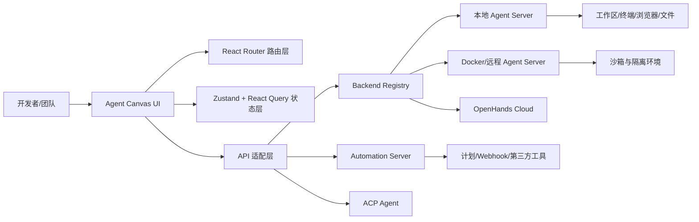

# OpenHands Agent Canvas 项目分析报告

> 分析对象：`OpenHands-main.zip` 中的 OpenHands Agent Canvas 代码快照
>
> 分析日期：2026-08-14
>
> 说明：本报告基于压缩包内的 README、架构文档、路由、API 适配层、组件目录、配置和测试目录进行静态分析。该仓库的主体是 Agent Canvas 前端与本地运行编排层，真正执行智能体动作的 Agent Server、沙箱和自动化后端位于独立运行时或外部服务中。

## 一、结论摘要

OpenHands Agent Canvas 不是“又一个聊天式 AI 编程工具”，而是一个**面向开发者的智能体控制中心**：把多个 Coding Agent、多个运行后端、开发工作区和自动化流程统一到一个可视化界面中。

它的核心产品判断有三点：

1. **智能体是可运行的工程执行单元，而不只是聊天窗口。** 用户可以查看终端、浏览器、文件、代码变更、提交记录和任务计划，形成从意图到工程结果的闭环。
2. **运行环境与交互界面解耦。** Agent 可以运行在本机、Docker、虚拟机、公司基础设施或 OpenHands Cloud，Canvas 负责连接、切换、监控和管理。
3. **一次性对话升级为持续的工程自动化。** 除了手动启动会话，还支持按计划或 Webhook 触发自动化，并连接 Slack、GitHub、Linear、Notion 等外部工具。

综合来看，Agent Canvas 试图成为“开发者的 Agent 操作系统/控制平面”：前端负责统一体验，Agent Server 负责执行，Automation Server 负责持续触发，ACP 负责接入不同厂商的 Agent。

## 二、项目基本画像

| 项目 | 结论 |
|---|---|
| 产品名称 | OpenHands Agent Canvas |
| npm 包 | `@openhands/agent-canvas` |
| 压缩包中声明版本 | `1.13.0` |
| 项目状态 | README 标注为 Beta |
| 主要技术 | React 19、TypeScript、React Router 7、Vite、Tailwind CSS、Zustand、TanStack React Query、Electron |
| 运行方式 | npm 本地启动、Docker 沙箱、源码启动、桌面端打包、作为组件库嵌入 |
| 主要执行后端 | OpenHands Agent Server |
| 可选后端 | Automation Server、OpenHands Cloud、远程/自建 Agent Server |
| Agent 兼容方向 | OpenHands、Claude Code、Codex、Gemini 及其他 ACP Agent |
| 开源协议 | MIT |
| 工程规模信号 | `src/components` 约 585 个文件，`src/hooks` 约 200 个文件；测试目录约 545 个单元/组件测试文件、40 个 E2E 相关文件 |

需要特别注意：压缩包不是完整的 Python Agent Server 仓库，而是一个以 TypeScript/React 为主的 Agent Canvas 前端工程，同时包含 CLI、开发启动器、Docker/Electron 打包和后端 API 适配代码。

## 三、产品理念与目标用户

### 3.1 产品理念

**从“问 AI”转向“委托 AI 完成工程任务”。** 传统 AI 编程产品围绕输入框和代码补全展开；Agent Canvas 的界面和路由则更像工程控制台：会话、任务列表、计划、终端、浏览器、文件、变更、提交、运行状态和后端连接都被显式建模。重点是任务执行过程的可见性、可恢复性和可操作性。

**从单 Agent 转向 Agent 平台。** Agent Server Registry、后端健康检查、活动后端切换和最近会话关联能力，加上 ACP 对外部 Agent 的接入，降低了用户对某一模型或实现的绑定。

**从本地工具转向可部署控制平面。** 本地、Docker、远程 VM、云端和桌面端并存，体现了从个人开发工具到团队基础设施的扩展路线。always-on engineering team 的叙事也意味着 Agent 可以在用户离开电脑后继续运行，并通过第三方事件触发。

**开放模型、开放后端、开放集成。** LLM Profiles、ACP Agent、MCP、插件、Skills 和多种后端入口共同形成扩展体系。

### 3.2 目标用户

- 个人开发者：希望在本机或 Docker 中让 Agent 修改代码、运行命令并检查结果。
- 高级工程师/技术负责人：需要同时管理本地、远程、云端多个 Agent 后端。
- 工程效率团队：希望把代码审查、Issue 拆解、依赖升级、报告生成等工作变成自动化任务。
- 企业平台团队：需要自托管、网络隔离、工作区边界、模型可替换和组织级运行控制。
- Agent/开发工具开发者：需要以组件库方式嵌入会话、文件、终端、设置等 UI 能力。

## 四、核心功能分析

### 4.1 Agent 会话与任务执行

核心路由包括会话列表、会话详情、会话面板、启动页和共享会话。会话层支持流式对话及 Agent 事件展示、任务状态、建议项、消息和上下文管理、暂停/恢复/删除/下载/公开标记、文件上传、工作区路径、子会话/子任务以及会话级后端切换。

这说明产品不是简单聊天 UI，而是围绕“长任务生命周期”设计。

### 4.2 工程工作区可视化

会话内部提供 Terminal、Browser、Files、Changes、Commits/Git、Planner/Task List、Usage/指标等视图。用户不仅看到“AI 说了什么”，还可以检查“AI 做了什么、改了什么、是否已经提交、是否仍在运行”。这是 Agent 产品建立信任的关键。

### 4.3 多后端管理

Canvas 把 Agent Server 抽象为可注册后端，支持本机、Docker、远程机器/虚拟机、公司内部基础设施、OpenHands Cloud/Enterprise；同时提供多后端切换、健康检查、活动后端、默认后端和最近会话记忆。

架构文档明确指出，Canvas 不负责直接执行 Agent 动作，也不负责沙箱隔离；运行时、凭证和隔离策略由后端负责。

### 4.4 自动化与工作流

自动化是本项目区别于普通 Coding Agent UI 的关键能力。相关路由包括自动化列表、模板、新建配置和详情页；API 层有 Automation Service，并包含自动化 manifest、目录、设置流程和触发接口。

支持按时间计划运行、通过 Webhook 或第三方事件触发、使用预构建模板、连接 Slack/GitHub/Linear/Notion、查看运行结果和关联会话。典型用例是生成工程报告并发布到 Slack、把 GitHub Issue 拆成任务、定期执行依赖或代码维护。

### 4.5 外部 Agent 与工具扩展

- **ACP Agent**：通过 Agent-Client Protocol 接入 Claude Code、Codex、Gemini CLI 等外部 Agent。
- **MCP**：配置 MCP Server、检查健康状态、管理凭证和测试连接。
- **Skills**：管理可复用技能和技能设置。
- **Plugins/Extensions**：通过插件和扩展中心增加能力或提供自动化入口。
- **LLM Profiles**：配置模型供应商、模型、参数和多个配置档案，实现 Bring Your Own Model。

这形成三层可组合性：模型层可替换，Agent 层可替换，工具/工作流层可扩展。

### 4.6 设置、凭证与组织化使用

设置路由覆盖 LLM、Agent、Agent Profiles、Condenser、Agent Context、Verification、应用设置和 Secrets。Cloud API 适配层还涉及 Organization、Sandbox、Profiles 和 Secrets。设置体系承担模型配置、Agent 行为与上下文、Git/工作区参数、第三方服务凭证等职责。

## 五、技术架构与模块分工

### 5.1 前端、状态与 API

项目使用 React 19 + TypeScript + React Router 7，路由覆盖会话、设置、自动化、MCP、Skills、Plugins 和共享会话。`src/components` 按 conversation、chat、browser、files、terminal、automations、settings、backends、plugins、skills 等领域拆分。

Zustand 保存会话、UI、导航和后端注册等客户端状态；TanStack React Query 管理服务端数据、缓存、轮询和异步 mutation；API Service 对 Agent Server、Cloud、Automation、Git、Settings、MCP、Skills 等服务做适配；MSW 为开发和测试提供 mock API。

### 5.2 运行与分发

- `agent-canvas` CLI：一条命令启动本地完整栈。
- 开发启动器：支持完整栈、最小栈、静态构建和额外后端。
- Docker：提供带沙箱的运行方式。
- Electron：支持桌面应用打包。
- Library Build：导出 browser、conversation、files、settings、sidebar、terminal、i18n 等子路径，便于嵌入其他宿主应用。

### 5.3 工程质量

项目包含单元测试、组件测试、API 测试、路由测试、E2E 测试、Mock LLM 测试和 CI 工作流。文档列出的质量门禁包括 TypeScript 类型检查、ESLint、Prettier、单元/组件测试、应用构建、库构建和 npm 打包校验。工程重点是前端平台稳定性和多运行模式兼容性。

## 六、典型用户流程

### 流程 A：本地开发任务

1. 用户通过 npm、源码或桌面端启动 Canvas。
2. Canvas 连接本机 Agent Server，或选择已注册后端。
3. 用户选择模型/Agent Profile，指定工作区并创建会话。
4. Agent 在工作区内执行命令、读写文件、运行测试。
5. 用户在聊天、终端、文件、浏览器、Changes、Commits 等视图中观察结果。
6. 用户人工确认、继续追问、暂停或切换后端。

### 流程 B：持续自动化

1. 用户从自动化模板或自定义配置创建自动化。
2. 配置触发方式、第三方连接、工作区和 Agent 上下文。
3. Automation Server 按计划或事件触发执行。
4. Agent Server 创建会话并执行任务。
5. 结果回传到 Canvas，并可发布到 Slack 或其他系统。

### 流程 C：企业/远程部署

在 VM、专用机器或云环境部署 Canvas 与 Agent Server，使用 HTTPS、认证、防火墙和工作区范围控制进行加固；本地 Canvas 连接远程后端，多个团队或个人后端通过注册表切换管理。

## 七、产品优势

1. **定位差异明显：** 同时覆盖 Coding Agent UI、后端管理和自动化控制台。
2. **运行环境可迁移：** 本地、Docker、VM、云端和桌面端并存，适配成本、性能、隐私和运维要求。
3. **开放性较强：** ACP、MCP、插件、Skills、LLM Profiles 和库导出共同构成开放生态。
4. **可观察性和人工接管较强：** 终端、文件、差异、提交、计划和事件视图增强审计与信任。
5. **有团队平台化潜力：** 自动化、远程后端、组织/云 API、Secrets 和多形态分发预留了企业能力。

## 八、限制、风险与产品挑战

### 8.1 安全边界是首要风险

无沙箱模式下，Agent Server 可能直接访问宿主机文件系统。生产部署需要认证、HTTPS、网络隔离、最小权限、工作区白名单、凭证保护和审计策略；笔记本场景更适合 Docker 沙箱。

### 8.2 前端和版本复杂度较高

组件、hooks、API 和路由数量较多，状态同步、错误恢复和兼容性成本高。Agent Server、Automation Server、Cloud API、ACP Agent 的版本变化也会增加联调压力。

### 8.3 用户心智模型复杂

“后端”“Agent”“Agent Profile”“LLM Profile”“MCP”“Skill”“Plugin”“Automation”“Workspace”等概念密集。需要向导、默认配置、可视化状态和更清晰的错误说明。

### 8.4 长任务可靠性要求高

自动化和 always-on 场景会放大超时、断线、重复触发、幂等、部分成功、费用失控和上下文膨胀问题。前端有轮询、重试和状态管理基础，但生产稳定性依赖后端执行器和调度系统。

### 8.5 模型质量和成本不可控

BYOM 提高开放性，但模型在工具调用、长上下文、代码修改和安全遵循方面差异很大。适合增加模型能力分级、预算控制、任务推荐和失败回退策略。

### 8.6 快照版本信息存在不一致信号

`package.json` 声明 `1.13.0`，而 `CHANGELOG.md` 仍主要记录早期 `1.0.0-alpha.2` npm 发布信息。部署或二次开发时应以 lockfile、Git tag、实际后端兼容版本和发布流水线为准。

## 九、商业与生态判断

Agent Canvas 的价值链是：**模型/Agent 接入 → 可视化任务执行 → 多后端管理与隔离 → 计划/Webhook 自动化 → 团队工程流程运营**。

长期价值不只来自一次代码生成，而来自会话历史、工作区、凭证、自动化、集成和后端配置形成的工作流黏性。潜在商业化方向包括 OpenHands Cloud/Enterprise、企业私有化部署、自动化模板/集成生态、嵌入式组件 SDK，以及按运行量或自动化任务量收费。

其生态位位于 AI IDE、Coding Agent、Workflow Automation 和 Developer Platform 的交叉点：比 AI IDE 更重视后端与自动化，比通用工作流平台更理解代码/Git/终端，比 Agent SDK 更提供完整控制台体验。

## 十、二次开发建议

1. **先复制控制平面思路：** 将 UI、Agent 执行器、沙箱、调度器和第三方集成拆成独立边界。
2. **先做可观察性，再做自动化：** 优先实现会话、事件流、终端、文件、差异、任务状态和人工暂停。
3. **工作区隔离默认开启：** 生产环境默认 Docker/VM/远程沙箱，不把宿主机读写权限作为默认体验。
4. **抽象 Agent 和模型：** 通过统一协议或适配器支持多个 Agent，模型配置与 Agent 配置分层管理。
5. **自动化必须有治理能力：** 具备幂等、超时、重试上限、预算、审批、凭证范围和审计日志。
6. **减少概念暴露：** 新用户只看到“选择 Agent—选择项目—描述任务”，高级用户再展开 MCP、Skills、Condenser 等设置。
7. **建立兼容性矩阵：** 明确 Canvas、Agent Server、Automation Server、ACP Agent 和 Cloud API 的版本对应关系。

## 十一、最终评价

Agent Canvas 是一个方向明确、平台化倾向强的开源项目。它的真正创新点不在于重新发明聊天框，而在于把 Coding Agent 组织成可连接、可观察、可切换、可自动触发的工程执行系统。

> **让开发者用一个统一控制中心，安全地运行和管理任何 Coding Agent，并把重复的工程工作变成持续自动化。**

项目已经具备较完整的前端平台骨架、运行模式和扩展接口；下一阶段的关键不再是增加更多页面，而是提升安全隔离、可靠执行、权限治理、版本兼容、成本可控和新用户上手效率。